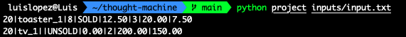
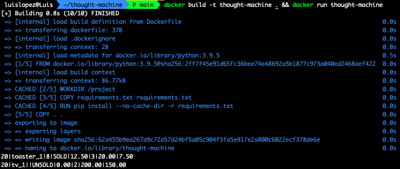
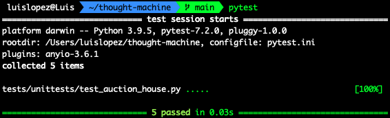

# thought-machine


I assume we do not care about the bids before the auction happens
I assume the BID / SELL / HEARTBEAD number of parameters will not change
I assume a BID on an Item which is not higher than the current bid price or reserve price makes it an invalid bid


How to run 

```
$ python project inputs/input.txt
```



If you don't have python v3.9.5 installed but you have docker, run this cmd:

```
$ docker build -t thought-machine . && docker run thought-machine 
```



How to run tests

```
$ pytest
```

