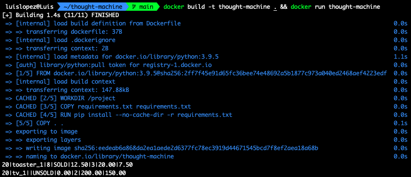

# Thought Machine - Auction House

### Useful links:
- [Project entrypoint](/project/__main__.py)
- [Main auction house processor class](/project/auction_processor.py)
- [Input helper class](/project/input_row_processor.py)
- [Output helper class](/project/output_row_processor.py)
- [Tests](/tests/unittests/test_auction_house.py)
- [Input files](/inputs/)

### Assumption:
- I assume we do not care about the bids before the auction begins
- I assume if there is only one valid bid, that is the highest and lowest bid at the same time
- I assume the BID / SELL / HEARTBEAD number of parameters will not change
- I assume a BID on an item which is not higher than the current bid price or reserve price makes it an invalid bid


### How to run it?
If you have python v3.9.5 installed, simply run:
```
$ python project inputs/input.txt
```


If you don't have the required python version installed but you have docker, run:

```
$ docker build -t thought-machine . && docker run thought-machine 
```



How to run tests?
> if you don't have pytest installed, run the cmd below else skip this step
```
$ pip install --no-cache-dir -r requirements.txt
```

Run tests:

```
$ pytest
```

